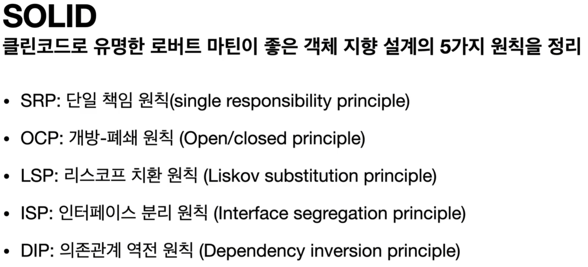

### 다형성의 본질

* 클라이언트를 변경하지 않고, 서버의 구현 기능을 유연하게 변경할 수 있다.
* 인터페이스를 안정적으로 잘 설계해야 구현체만 변경하며 사용 가능하다. 따라서 인터페이스가 변하면 클라이언트, 서버 모두 큰 변경이 발생한다.

---

### 좋은 객체 지향 설계의 5가지 원칙(SOLID)

* SRP : 중요한 기준은 변경이다. 변경이 있을 때 파급 효과가 적으면 단일 책임 원칙을 잘 따른 것이다.
* OCP : 소프트웨어 요소는 확장에는 열려 있으나 변경에는 닫혀 있어야 한다.
* LSP : 프로그램의 목적에 맞게 구현체를 구현해야 한다.
* ISP : 너무 큰 인터페이스보다 목적에 맞는 인터페이스가 분리되어 있는 것을 말한다.
* DIP : 역할에 의존하게 해야 한다는 것과 같다. 클라이언트가 인터페이스에 의존해야 유연하게 구현체를 변경할 수 있다.